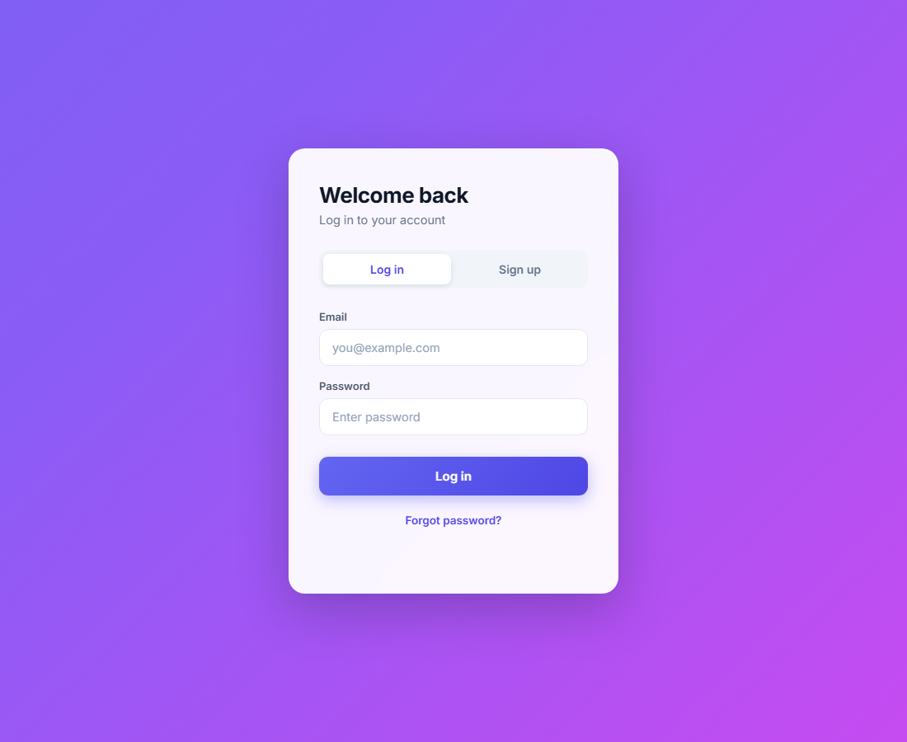
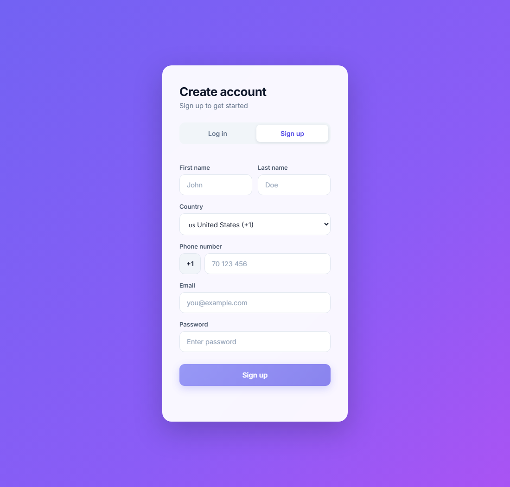

# Login Page (React + Express + PostgreSQL)

A full-stack login/signup app with email notifications, password reset,
strong-password rules, and country-aware phone validation.

## Screenshots

| Log in | Sign up |
|--------|---------|
|  |  |

## Project structure

```
login page/
├─ backend/        Express API (server.js) + PostgreSQL
└─ react-login/    React app (Vite)
```

## Features

- Sign up / log in with email + password (passwords hashed with bcrypt).
- **Strong password** required: 8+ chars, upper + lower case, and a number.
  Accidental spaces are stripped automatically.
- **Profile fields**: first name, last name, country, and phone number.
- **Phone validation**: the number must be valid for the selected country
  (via libphonenumber-js) — a US-length number won't pass while "Lebanon"
  is selected, etc.
- **Forgot / reset password** by email link.
- **Login history**: every login/signup is recorded in a `login_history` table.
- Email notifications on sign-in (Gmail, with an Ethereal test-inbox fallback).

## Database

PostgreSQL database named `loginapp` with three tables (auto-created on start):

- `users` — email, password_hash, first_name, last_name, phone, country, timestamps
- `password_resets` — one-time reset tokens
- `login_history` — one row per login (id, email, logged_in_at)

Connection settings live in `backend/.env` (PGHOST, PGPORT, PGUSER,
PGPASSWORD, PGDATABASE).

## Setup & run (step by step)

You need **Node.js** and **PostgreSQL** installed.

### 1. Create the database

In `psql` (or pgAdmin), create an empty database:

```sql
CREATE DATABASE loginapp;
```

The three tables (`users`, `password_resets`, `login_history`) are created
**automatically** the first time the backend starts — no manual table setup.

### 2. Configure the backend

```bash
cd backend
npm install
cp .env.example .env       # then edit .env
```

Open `backend/.env` and set your own PostgreSQL details:

```
PGHOST=localhost
PGPORT=5432
PGUSER=postgres
PGPASSWORD=your-postgres-password   # <- your password
PGDATABASE=loginapp
JWT_SECRET=any-long-random-string
FRONTEND_URL=http://localhost:5173
```

(You can leave `GMAIL_USER` / `GMAIL_APP_PASSWORD` blank — the app falls
back to a free Ethereal test inbox and prints a preview link in the console.)

### 3. Start the backend

```bash
npm start          # http://localhost:3001
```

You should see `✅ Connected to PostgreSQL database "loginapp"`.

### 4. Start the frontend (second terminal)

```bash
cd react-login
npm install
npm run dev        # http://localhost:5173
```

Then open **http://localhost:5173** in a browser and use the Sign up / Log in form.

## Notes

- `backend/.env` contains secrets (DB password, Gmail App Password, JWT secret).
  Keep it private — never commit or share it publicly.
- Existing accounts created before the strong-password / phone rules were
  added are unaffected; the rules apply to new signups and password resets.
